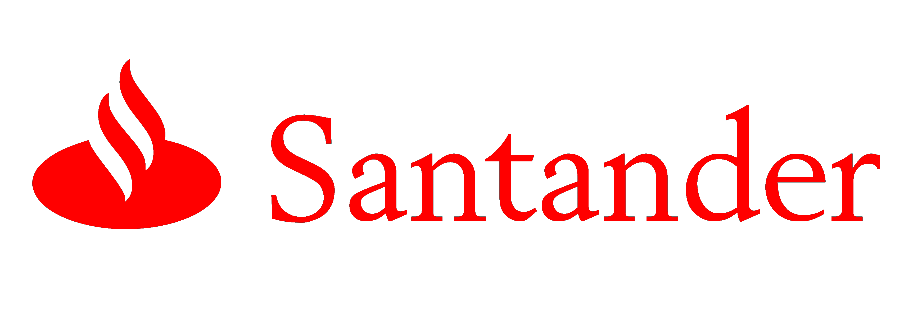

# Santander Value Prediction Challenge

In this competition, Santander Group is asking Kagglers to help them identify the value of transactions for each potential customer. This is a first step that Santander needs to nail in order to personalize their services at scale.

Data is accesible at 
[Banco Santander | kaggle]([https://www.kaggle.com/competitions/santander-value-prediction-challenge/leaderboard](https://www.kaggle.com/competitions/santander-value-prediction-challenge/data))

The evaluation metric for this competition is Root Mean Squared Logarithmic Error (RMSE).

Several regression models have been trained. A Random Forest with 12 depths gets a RMSE of 1,90569. 
